<p align="center">
  
  
  
  
</p>

---

# 🕌 3D Mosque — Real-Time OpenGL Simulation

An interactive, real-time **3D mosque** scene built from scratch with **Modern OpenGL (3.3 Core)** and **C++**. The project demonstrates modular geometry construction from reusable primitives, Phong/Gouraud shading with multiple light types, texture mapping, Bézier curve–based mesh generation, and runtime animations — all rendered in a single monolithic application.

> **Course:** CSE-4208 — Computer Graphics Laboratory  
> **University:** Khulna University of Engineering & Technology (KUET)  
> **Author:** Shoab Ahamed — Roll: 2007015

---

## 📽️ Demo Video

<p align="center">
  <a href="https://youtu.be/e31fg3sdzOo">
    
  </a>
  <br/>
  <i>▶ Click the image above to watch the full demo on YouTube</i>
</p>

---

## 📦 Assets & Documents (Google Drive)

All texture images and the full demo video are too large for Git. They are hosted on **Google Drive**:

🔗 **[Download Assets & Documents](https://drive.google.com/drive/folders/1VpZn0UKkVeaXzutH9zgtIzSpFWMT0k6s?usp=sharing)**

---

## ✨ Features at a Glance

| Category | Details |
|---|---|
| **Primitive-Based Modeling** | Mosque body, minarets, dome, chandelier, bookshelves, trees, roads, and pond — all built from `Cube`, `Cylinder`, `Sphere`, and `Cone` primitives via hierarchical transforms |
| **Bézier Curve Mesh** | Mihrab niche generated from a cubic Bézier profile, sampled and extruded into a textured 3D mesh |
| **Phong & Gouraud Shading** | Switchable fragment (Phong) ↔ vertex (Gouraud) lighting at runtime |
| **3 Light Types** | Directional sun, 36 point lights (road lamps, veranda lamps, chandelier ring, interior pendants), 1 spot light (mosque interior) |
| **Texture Mapping** | 14 distinct textures loaded via `stb_image` with configurable wrapping/filtering |
| **Runtime Animations** | Doors, windows, ceiling fans, corner bookshelves — smooth interpolated open/close and continuous rotation |
| **Particle Water System** | Physics-based faucet water droplets with gravity, jitter, lifetime recycling |

---

## 🖼️ Project Snapshots

### Full Scene Overview
<p align="center">
  <!-- Full mosque exterior/isometric view -->
  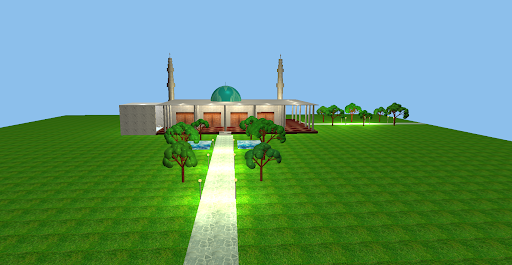
</p>

### Architectural Elements

<table>
  <tr>
    <td align="center">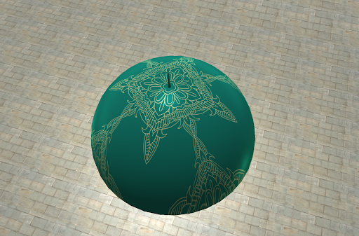<br/><b>Dome</b></td>
    <td align="center">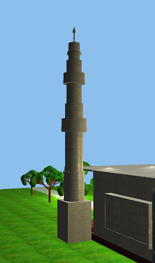<br/><b>Minarets</b></td>
  </tr>
  <tr>
    <td align="center">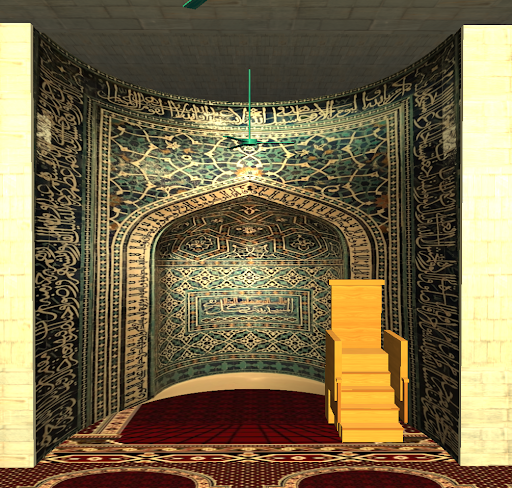<br/><b>Mihrab (Bézier Curve)</b></td>
    <td align="center">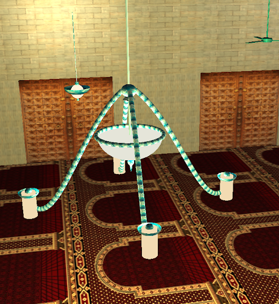<br/><b>Chandelier</b></td>
  </tr>
</table>

### Interactive Elements

<table>
  <tr>
    <td align="center">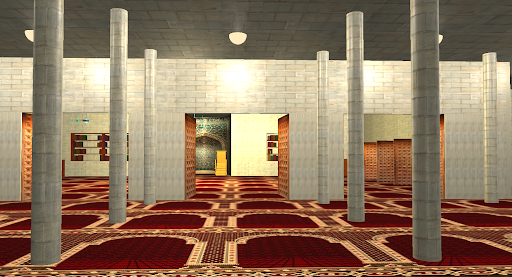<br/><b>Animated Doors</b></td>
    <td align="center">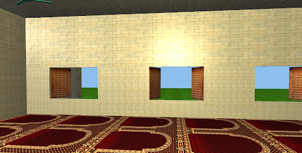<br/><b>Animated Windows</b></td>
  </tr>
  <tr>
    <td align="center">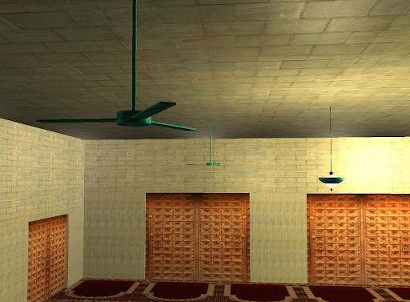<br/><b>Ceiling Fans</b></td>
    <td align="center">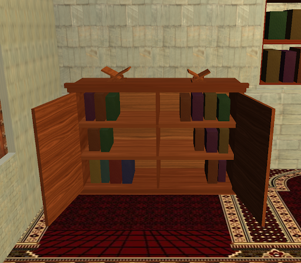<br/><b>Corner Bookshelves</b></td>
  </tr>
</table>

### Environment

<table>
  <tr>
    <td align="center">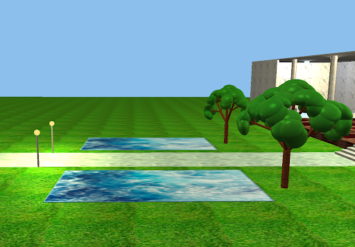<br/><b>Ponds & Trees</b></td>
    <td align="center">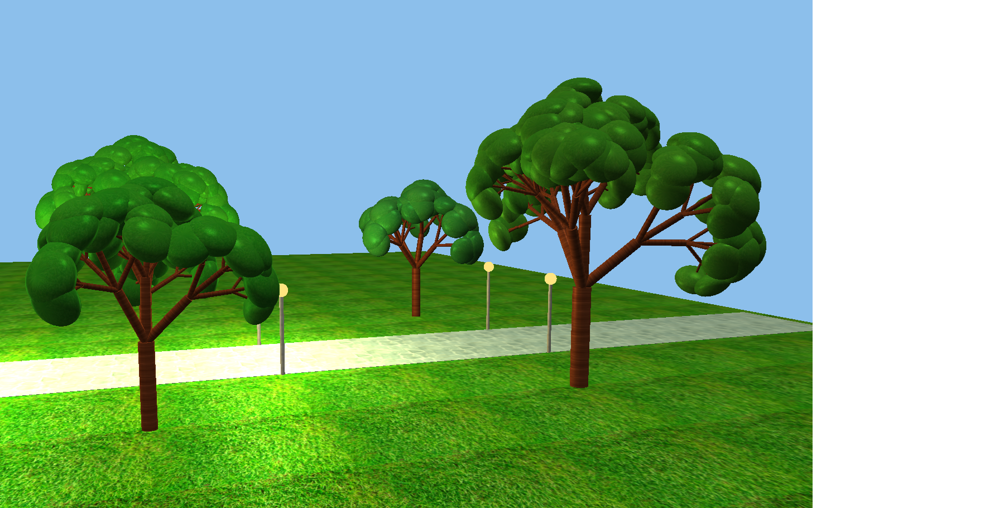<br/><b>Trees</b></td>
  </tr>
  <tr>
    <td align="center">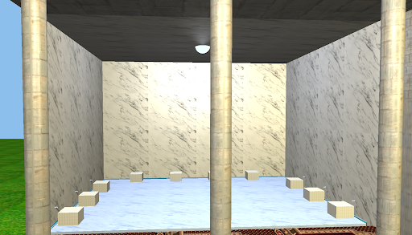<br/><b>Wadhu Area</b></td>
    <td align="center">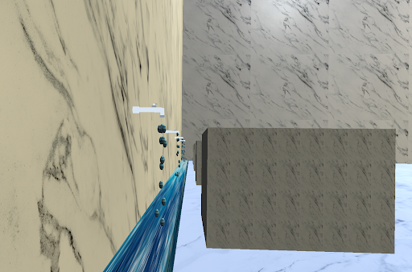<br/><b>Faucet & Water Particles</b></td>
  </tr>
</table>

---

## 🎮 Controls

| Key | Action |
|---|---|
| `TAB` | Cycle viewport (Isometric → Top → Front → Inside) |
| `W` / `S` | Move forward / backward |
| `A` / `D` | Move left / right |
| `E` / `R` | Move up / down |
| `Mouse` | Look around |
| `Scroll` | Zoom in / out |
| `X` / `Y` / `Z` | Rotate pitch / yaw / roll (+`Shift` to reverse) |
| `F` | Toggle orbit mode |
| `G` | Toggle shading (Phong ↔ Gouraud) |
| `1` | Toggle directional light (sun) |
| `2` | Toggle point lights (lamps) |
| `3` | Toggle spot light (mosque hanging bulb) |
| `4` | Toggle ceiling fans |
| `5` / `6` / `7` | Toggle ambient / diffuse / specular components |
| `O` | Open / close doors |
| `P` | Open / close windows |
| `H` | Toggle faucet water flow |
| `B` | Open / close corner bookshelves |
| `ESC` | Quit |

---

## 🏗️ Project Structure

```
3D Mosque/
├── main.cpp                  # Main application (~4300 lines) — scene setup & render loop
├── shader.h                  # Shader class (compile, link, uniform setters)
├── camera.h                  # FPS-style camera with mouse/scroll input
│
├── cube.h                    # Reusable Cube primitive (VAO/VBO)
├── cylinder.h                # Reusable Cylinder primitive
├── sphere.h                  # Reusable Sphere/Hemisphere primitive
├── cone.h                    # Reusable Cone primitive
├── bezier_mihrab.h           # Bézier profile → extruded mesh for the mihrab niche
│
├── dirLight.h                # Directional light data struct
├── pointLight.h              # Point light data struct
├── spotLight.h               # Spot light data struct
├── material.h                # Material properties struct
│
├── lighting.vs / lighting.fs # Phong fragment shader pair
├── gouraud.vs / gouraud.fs   # Gouraud vertex shader pair
├── light_cube.vs/fs          # Simple emissive cube shader
├── shader.vs / shader.fs     # Basic passthrough shader
│
├── stb_image.h / .cpp        # Single-header image loader
├── report.tex                # LaTeX source for the project report
│
├── *.jpg, *.png              # Texture assets (gitignored — see Google Drive)
├── Documents/                # Report PDF, slides, presentation, demo video
│   ├── 2007015_Report_3D_Mosque.pdf
│   ├── 2007015_Slide_3D_Mosque.pptx
│   ├── 2007015_Presentation_3D_Mosque.pdf
│   └── 2007015_Video_3D_Mosque.mp4   (gitignored)
│
├── CoordinateSystem.vcxproj  # Visual Studio project file
├── CoordinateSystem.slnx     # Visual Studio solution
└── .gitignore                # Git exclusions
```

---

## 🛠️ Tech Stack & Dependencies

| Component | Library / Tool |
|---|---|
| **Window & Input** | [GLFW 3](https://www.glfw.org/) |
| **OpenGL Loader** | [GLAD](https://glad.dav1d.de/) (OpenGL 3.3 Core) |
| **Math** | [GLM](https://github.com/g-truc/glm) |
| **Image Loading** | [stb_image](https://github.com/nothings/stb) |
| **Build System** | Visual Studio 2022 (MSVC) |

---

## 📐 Technical Highlights

### Bézier Mihrab
The mihrab's arched niche is constructed by sampling a cubic Bézier curve:

$$\mathbf{B}(t) = (1-t)^3 \mathbf{P}_0 + 3(1-t)^2 t \, \mathbf{P}_1 + 3(1-t) t^2 \, \mathbf{P}_2 + t^3 \mathbf{P}_3, \quad 0 \le t \le 1$$

The sampled profile is then extruded along the depth axis and tessellated into a triangle mesh with UV coordinates for texture mapping.

### Lighting Pipeline
- **36 point lights**: road lamps, veranda ceiling lamps, chandelier ring, interior pendants, wadhu area lamp
- **1 directional light**: global sun illumination
- **1 spot light**: focused cone light inside the mosque
- Each light type's ambient/diffuse/specular components can be toggled independently at runtime

### Particle Water System
Faucet droplets use a simple Euler integration physics model:
- Gravity acceleration: 11.5 m/s²
- Droplets are recycled from a fixed pool (16 per faucet × 10 faucets)
- Position jitter and velocity randomization create a natural flow appearance

---

## 📚 References

- [LearnOpenGL](https://learnopengl.com) — Joey de Vries
- *OpenGL SuperBible*, 7th Edition — G. Sellers, R. Wright, N. Haemel
- [GLFW Documentation](https://www.glfw.org/docs/latest/)
- [GLM (OpenGL Mathematics)](https://github.com/g-truc/glm)
- [stb_image](https://github.com/nothings/stb) — Sean Barrett
- *Real-Time Rendering* — A. K. Peters (foundational concepts)

---

## 📄 License

This project was developed as a course assignment for **CSE-4208** at KUET. 

---
